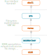

# FAT32 implementation

This project is meant to demonstrate a simple implementation of a FAT file system. It could possibly be used as a reference or an inspiration when creating another project off of this one.

## Compilation

The compilation process is done through the `make`command that's supposed to be executed in the root folder of the project structure. Once the process has completed, a file called `fat32` will be generated. This file represents the executable file of the application.

## Program diagram



## Implemented functionality

### List of available commands

| Command   | Explanation           | Example |
| ----------|:----------------------| -------|
| `ls`      | lists the contents of a directory | `ls /documents` |
| `pwd`     | prints out the absolute path of the current working directory | `pwd` |
| `mkdir`   | creates a new directory | `mkdir /tmp/doc` |
| `rmdir`   | removes an empty directory | `rmdir /tmp/doc` |
| `cd`   | changes the current working directory  | `cd ../tmp/doc` |
| `cat`   | prints out the content of a file  | `cat /dev/password`|
| `in`   | imports a file from your local machine into the current working directory  | `in Desktop/cat.png`|
| `out`   | exports a file onto your local machine  | `out cat.png` |
| `rm`   | removes a file from the file system  | `rm /Pictures/cat.png` |
| `mv`   | moves a file to a different location (could be also used for renaming files)  | `mv /Pictures/cat.png ../../tmp/` |
| `cp`   | copies a file  | `cp a.txt b.txt` |
| `tree`   | prints out recursively a tree-like structure of a given directory  | `tree /` |
| `info`   | prints out info about the file system (free space, cluster size, ...) | `info` |
| `load`   | loads a text file containing commands and executes them | `load cmds.txt` |

### Examples
```
/tmp> ls
type           size         parent          start          name
[-]        1048576              4          64194         random
[-]        1048576              4          72387           zero
[+]             36              4          80580         output
/tmp> tree
[+] tmp
  |_ [-] random
  |_ [-] zero
  |_ [+] output
       |_ [-] vid2_out.wbm
/tmp> rm output/vid2_out.wbm
/tmp> info
total clusters   : 397187
free clusters    : 348786
cluster size [B] : 128
total size   [B] : 50839936
free size    [B] : 44644608
free size    [%] : 87.8141
/tmp> cd ..
/> mkdir Pictures
/> ls
type           size         parent          start          name
[+]             36              0              2            doc
[+]             36              0              4            tmp
[+]             36              0              6            img
[+]             36              0          28858       Pictures
/> 
```

### Storage
So far, the only implementation of `IDiskDriver` is done using a `binary file` ("disk image") stored on the user's local machine. However, the generality of the interface offers different ways as well. For example, we could send data across a network which would turn the project into a client/server application.

### Testing